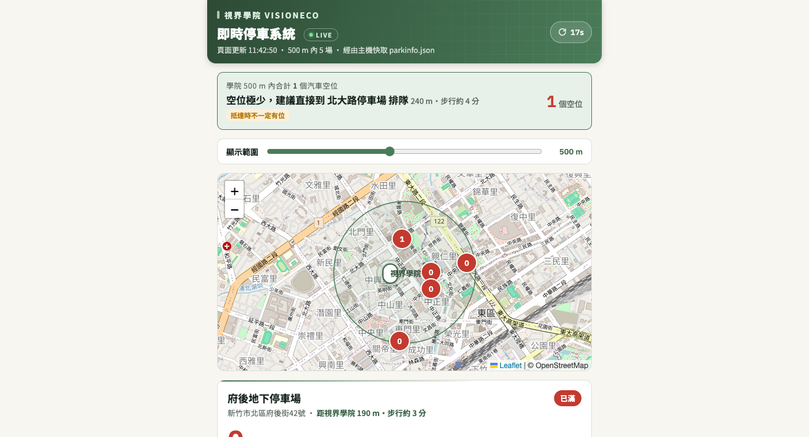

# 視界停車 Vision Parking

新竹市停車場**即時空位**查詢頁：以任一地點為圓心（本專案以[視界學院](https://visioneco.tw)新竹據點為例），顯示周邊停車場即時剩餘車位、智慧停車建議、YouBike 站點與歷史時段統計。

**Live Demo：https://visionecoparking.visioneco.tw/**

> A real-time parking availability dashboard for Hsinchu City, Taiwan — single-file static page + tiny VPS cron pipeline. Zero framework, zero build step, near-zero running cost.



## 功能

- 🅿️ **即時空位**：介接新竹市政府「好停車」開放資料，頁面每 20 秒自動更新
- 📍 **距離篩選**：以中心點畫圓（100 m〜1 km 滑桿可調），依「有位優先＋距離最近」動態排序
- 🧭 **智慧建議**：自動推薦去哪停；空位少提醒排隊、全滿建議一鍵擴大範圍；只剩電動／身障位會註明
- 🗺 **地圖**：Leaflet + OpenStreetMap，每場即時空位數直接標在地圖上
- 🚲 **YouBike 圖層**（可開關）：介接交通部 TDX，顯示各站可借／可還；採**需求驅動抓取**——沒人開圖層就零 API 呼叫，免費額度絕不爆
- 📊 **歷史統計**：每 10 分鐘快照進 SQLite，彙整「近 28 天平日／週末 × 24 小時平均剩餘」，卡片顯示「這時段通常剩約 N 位」
- 📱 **手機優先**：可加入主畫面（PWA manifest＋品牌圖示）、深色模式、`prefers-reduced-motion` 支援

## 架構

```
瀏覽器 ──每20秒──▶ nginx 靜態頁 + JSON 快取（同一台 VPS）
                        ▲
        cron 每20秒 ────┤ fetch-parkinfo.sh   ◀── 新竹市好停車 OpenData
        cron 需求驅動 ──┤ fetch-tdx.py        ◀── 交通部 TDX（YouBike）
        cron 每10分 ────┘ log-parkstats.py    ──▶ SQLite → stats.json
```

設計原則：**頁面不直連任何第三方 API**。伺服器把外部資料抓成靜態 JSON，瀏覽器只讀自己主機的快取——速度快、不怕 CORS、不怕把上游打掛，API 金鑰也永遠不會出現在前端。

## 快速部署

需求：一台 Ubuntu/Debian VPS（1GB RAM 足夠）＋（選用）網域。

```bash
# 1. 把整個資料夾放上 VPS，執行：
sudo bash deploy-vps.sh
# 會自動：裝 nginx、放置頁面、設 cron、開防火牆 80 port

# 2.（選用）YouBike 圖層：到 https://tdx.transportdata.tw 免費註冊拿金鑰
sudo tee /etc/parking-tdx.env <<EOF
TDX_ID=你的ClientId
TDX_SECRET=你的ClientSecret
EOF
sudo chmod 600 /etc/parking-tdx.env
sudo bash deploy-vps.sh   # 重跑一次讓 TDX 排程生效

# 3.（選用）HTTPS：DNS A 紀錄指到 VPS 後
sudo apt install certbot python3-certbot-nginx
sudo certbot --nginx -d 你的網域
```

## 改成你自己的地點

只要改 `hsinchu-parking.html` 裡的三個常數：

```js
const CENTER = { lat: 24.80725, lng: 120.96794 };  // 你的中心點座標
const RADIUS_MIN = 100, RADIUS_MAX = 1000, RADIUS_DEF = 500;  // 範圍滑桿
```

換其他城市則需替換資料來源 `API`（各縣市停車開放資料格式不同，`render()` 內的欄位對應需一併調整）。

## 免費額度保護（TDX）

TDX 免費會員每月只有 3 個虛擬點數（≈4,500 次基礎服務呼叫）。本專案內建兩層保護：

1. **需求驅動**：`fetch-tdx.py` 先查 nginx access log，近 5 分鐘沒有人開 YouBike 圖層就一次 API 都不叫
2. **每月保險絲**：累計 4,000 次呼叫自動停抓到月底

## 資料來源與致謝

- 停車場即時資訊：[新竹市政府交通處「好停車」開放資料](https://hispark.hccg.gov.tw/)（[政府資料開放平臺 #129136](https://data.gov.tw/dataset/129136)）
- YouBike 即時資訊：[交通部 TDX 運輸資料流通服務](https://tdx.transportdata.tw/)
- 地圖圖資：© [OpenStreetMap](https://www.openstreetmap.org/copyright) 貢獻者

本專案與新竹市政府、交通部無任何隸屬關係；資料僅供參考，實際車位以現場為準。

## License

[MIT](LICENSE) — 歡迎自由使用、修改、部署到你的城市。如果對你有幫助，給顆 ⭐ 就是最好的回饋！
